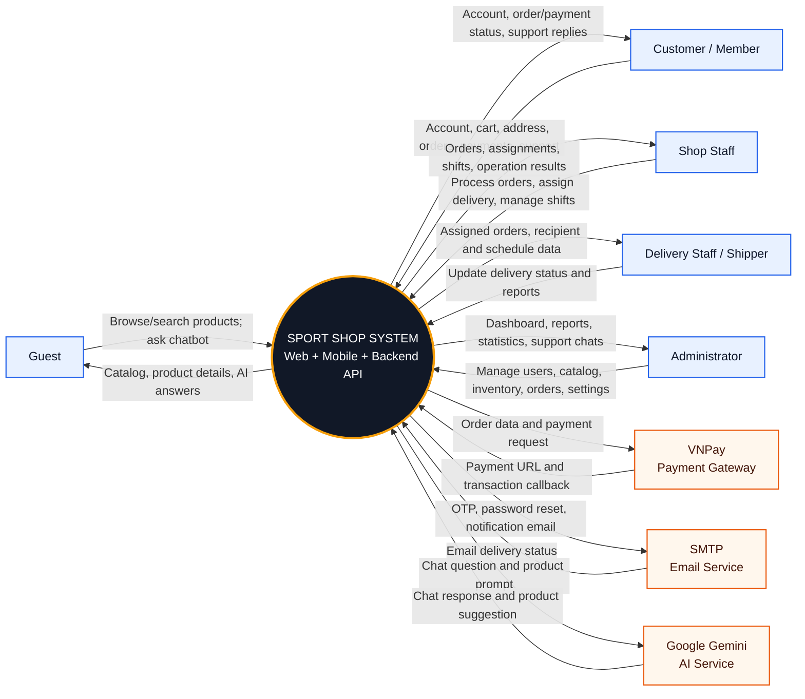

# Context Diagram - Sport Shop System

This diagram models Sport Shop as one system and shows its users and external integrations.

## Actors and Data Flows

| Actor / external system | Data sent to Sport Shop | Data received from Sport Shop |
|---|---|---|
| Guest | Search criteria, filters, chatbot questions | Catalog, product details, AI responses |
| Customer | Account, cart, address, order, payment and support data | Authentication, product, order/payment and support results |
| Shop Staff | Order processing, shipper assignment, shift updates | Orders, assignments, shifts and operation results |
| Delivery Staff | Delivery status and delivery reports | Assigned orders, recipient details and schedules |
| Administrator | User, staff, catalog, inventory, order and settings updates | Dashboard, reports, statistics and operational data |
| VNPay | Transaction callback and payment result | Payment request and order information |
| SMTP | Email delivery status | OTP, password reset and notification messages |
| Google Gemini | Generated AI content | Chat questions and product suggestion prompts |

## System Boundary

- Inside: web UI, Flutter app, Spring Boot services, authentication, catalog, cart, orders, delivery, reporting and chat.
- Outside: user roles, VNPay, SMTP and Google Gemini.
- PostgreSQL and Redis are internal infrastructure, so they are not external context actors.
