# ARCHITECTURE.md - Kiến trúc Dự án (Clean Architecture & Layers)

Tài liệu này mô tả chi tiết kiến trúc phần mềm, cấu trúc thư mục, các lớp (layers) và quy tắc phụ thuộc (dependency rules) áp dụng trong dự án Flutter **sportswear-shop-system (mobile)**.

---

## 1. Tổng quan Kiến trúc

Dự án áp dụng mô hình **Clean Architecture** kết hợp với mô hình **MVP \(Model-View-Presenter\)** gọn nhẹ để quản lý trạng thái. Kiến trúc được thiết kế nhằm đạt được sự độc lập giữa giao diện người dùng, logic nghiệp vụ và các nguồn dữ liệu bên ngoài.

```mermaid
graph TD
    %% Lớp Giao diện (Presentation Layer)
    subgraph Presentation Layer
        View[View / Screen - lib/view]
        Widget[Custom Widgets - lib/widgets]
        Presenter[Presenter - lib/presenter]
    end

    %% Lớp Nghiệp vụ / Dữ liệu (Domain & Data Layer)
    subgraph Data & Domain Layer
        Repository[Repository - lib/repository]
        Service[API Service - lib/service]
        Model[Domain Model - lib/model]
    end

    %% Lớp Cốt lõi (Core Layer)
    subgraph Core Layer
        ApiClient[ApiClient - lib/core/network]
        Storage[TokenStorage - lib/core/storage]
        DI[AppDependencies - lib/core/di]
        Router[GoRouter - lib/app]
    end

    %% Luồng phụ thuộc (Dependency Rule)
    View -->|Lắng nghe trạng thái| Presenter
    Presenter -->|Constructor Injection| Repository
    Repository -->|Triển khai interface| Service
    Repository -->|Lưu trữ token| Storage
    Service -->|Yêu cầu HTTP| ApiClient
    DI -->|Khởi tạo & Cung cấp| Repository
    DI -->|Khởi tạo & Cung cấp| Service
    Router -->|Điều hướng| View
    
    %% Sử dụng chung Models
    Presenter -.-> Model
    Repository -.-> Model
    Service -.-> Model
```



---

## 2. Mô tả các Lớp trong Hệ thống (Layers)

### 2.1 Core Layer (`lib/core/`)
Là nơi chứa các thành phần dùng chung cho toàn bộ ứng dụng, ít khi thay đổi theo logic nghiệp vụ cụ thể.
* **`network/` (ApiClient, ApiEndpoints):** Cấu hình client HTTP (sử dụng thư viện `Dio`), thiết lập timeout, thêm header Authorization (Bearer Token), xử lý exception tập trung thành lỗi tiếng Việt dễ hiểu (`ApiException`).
* **`storage/` (TokenStorage):** Quản lý lưu trữ cục bộ các thông tin nhạy cảm như Access Token, Refresh Token, Role của người dùng đang đăng nhập thông qua `FlutterSecureStorage`.
* **`di/` (AppDependencies):** Đóng vai trò là một Service Locator tập trung theo mô hình Singleton, chịu trách nhiệm khởi tạo và kết nối các Service và Repository tương ứng.
* **`theme/` & `constants/`:** Định nghĩa hệ thống Design System gồm màu sắc (`AppColors`), kiểu chữ (`AppTextStyles`), khoảng cách lề (`AppSpacing`), và các hằng số cấu hình.

### 2.2 Domain / Model Layer (`lib/model/`)
Chứa các thực thể dữ liệu (entities) thuần túy của ứng dụng, không bị phụ thuộc vào các thư viện bên ngoài hay các thành phần UI.
* Định nghĩa các phương thức ánh xạ JSON như `fromJson` và `toJson` để chuyển đổi dữ liệu từ API.
* Được phân chia theo phân hệ chức năng: `admin/`, `auth/`, `chat/`, `customer/`, `delivery_staff/`, `common/`.

### 2.3 Remote Service Layer (`lib/service/`)
Đóng vai trò là cầu nối trực tiếp tới REST API của Backend.
* Mỗi module chức năng đều khai báo một giao diện (`abstract interface class`) và một lớp triển khai cụ thể (ví dụ: `AuthService` và `AuthApiService`).
* Lớp Service sử dụng `ApiClient` để gửi các yêu cầu HTTP (GET, POST, PUT, DELETE, PATCH) và chuyển đổi kết quả JSON thô nhận được thành các Model tương ứng.

### 2.4 Data Repository Layer (`lib/repository/`)
Chịu trách nhiệm cung cấp dữ liệu sạch cho Presenter, điều phối nguồn dữ liệu giữa Remote API (Service) và Local Storage (Token Storage).
* Giúp che giấu chi tiết triển khai lấy dữ liệu ở đâu và như thế nào khỏi lớp nghiệp vụ.
* Tách biệt interface và triển khai cụ thể (ví dụ: `AuthRepository` và `AuthRepositoryImpl`).

### 2.5 Presenter Layer (`lib/presenter/`)
Chứa logic nghiệp vụ của màn hình giao diện (Presentation logic) và quản lý trạng thái UI.
* Kế thừa `ChangeNotifier` của Flutter.
* Nhận các Repositories cần thiết thông qua hàm dựng (Constructor Injection).
* Chịu trách nhiệm xác thực dữ liệu đầu vào của biểu mẫu (Form validation), gọi API qua Repository, quản lý cờ trạng thái (`isLoading`, `isUpdating`, `errorMessage`), và thông báo cho View cập nhật giao diện bằng `notifyListeners()`.

### 2.6 Presentation Layer (`lib/view/`, `lib/widgets/`)
Chứa giao diện người dùng thực tế và điều hướng.
* Gồm các trang màn hình (`Pages` / `Screens`) được phân chia theo vai trò người dùng (Admin, Customer, Delivery Staff, Public, Splash).
* Các View sử dụng `StatefulWidget`, khởi tạo Presenter tương ứng và lắng nghe các thay đổi bằng cách thêm Listener vào Presenter:
  ```dart
  _Presenter.addListener(() {
    if (mounted) setState(() {});
  });
  ```
* Hệ thống định tuyến ứng dụng sử dụng `GoRouter` (`lib/app/sportshop_router.dart`), tích hợp bộ lọc chuyển hướng tự động (Route Guard) dựa trên vai trò (Role) và trạng thái Token hiện tại của người dùng.

---

## 3. Quy tắc phụ thuộc (Dependency Rule)

1. **Chiều phụ thuộc một chiều (Inward Dependency):**
   * Các lớp bên ngoài (UI/Presentation) phụ thuộc vào các lớp bên trong (Presenter, Repository).
   * Lớp bên trong tuyệt đối không biết gì về chi tiết của lớp bên ngoài. Ví dụ: Repository không bao giờ chứa code UI hay tham chiếu tới Widget.
2. **Lập trình hướng giao diện (Interface-based Programming):**
   * Presenter chỉ tham chiếu tới các lớp giao diện `interface` của Repository (ví dụ: `AuthRepository`), không tham chiếu trực tiếp lớp hiện thực `AuthRepositoryImpl`. Điều này giúp dễ dàng viết mock test cho Presenter.
3. **Quản lý Vòng đời Đối tượng (Lifecycle Management):**
   * Hầu hết các Repository và Service là các biến khởi tạo trễ (`late final`) dạng Singleton bên trong `AppDependencies` và tồn tại suốt vòng đời ứng dụng.
   * Ngược lại, các Presenter được khởi tạo tại `initState` của View và tự giải phóng bộ nhớ (`_Presenter.dispose()`) tại `dispose` của View để tránh rò rỉ bộ nhớ (memory leaks).
